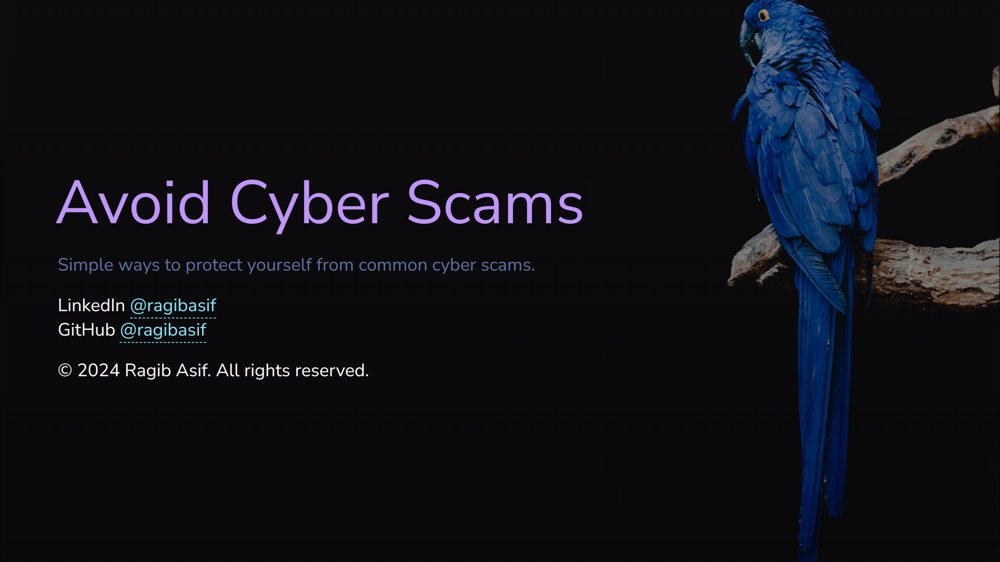

<h1>Avoid Cyber Scams</h1>

<div align="center">
<br />

[](LICENSE)

[](https://github.com/ragibasif/avoid-cyber-scams/issues?q=is%3Aissue+is%3Aopen+label%3A%22help+wanted%22)
[](https://github.com/ragibasif)

</div>

<details open="open">
<summary>Table of Contents</summary>

- [About](#about)
  - [Built With](#built-with)
- [Getting Started](#getting-started)
  - [Prerequisites](#prerequisites)
  - [Installation](#installation)
- [Support](#support)
- [Project assistance](#project-assistance)
- [Contributing](#contributing)
- [Authors \& contributors](#authors--contributors)
- [Security](#security)
- [License](#license)
- [Acknowledgements](#acknowledgements)

</details>

---

## About

This presentation was built for [CSPSC](https://cspsc-hacks.devpost.com/)
hackathon. It aims to give senior citizens, or anyone unfamiliar with protecting
themselves against cyber scams, a rudimentary introduction. It is not meant to
be a comprehensive list of methods. It is intended to be an easy-to-understand
and easy-to-follow general guide.

<a href="https://youtu.be/ETqMe8PKmag" target="_blank">Demo on YouTube</a>

<details>
<summary>Screenshots</summary>
<br>

|                                     Cover Page                                      |
| :---------------------------------------------------------------------------------: |
|  |

</details>

### Built With

- Slidev
- Markdown

## Getting Started

### Prerequisites

- git
- npm

### Installation

1. Clone the repository:

```bash
git clone https://github.com/ragibasif/avoid-cyber-scams.git
cd avoid-cyber-scams
```

2. To start the slide show:

- `npm install`
- `npm run dev`
- visit http://localhost:3030

3. Make changes:

Edit the [slides.md](./slides.md) to see the changes.

Learn more about Slidev on [documentations](https://sli.dev/).

## Support

Reach out to the maintainer at one of the following places:

- [GitHub issues](https://github.com/ragibasif/avoid-cyber-scams/issues/new?assignees=&labels=question&template=04_SUPPORT_QUESTION.md&title=support%3A+)
- Contact options listed on [this GitHub profile](https://github.com/ragibasif)

## Project assistance

If you want to say **thank you** or/and support active development of avoid-cyber-scams:

- Add a [GitHub Star](https://github.com/ragibasif/avoid-cyber-scams) to the project.
- Tweet about the avoid-cyber-scams.
- Write interesting articles about the project on [Dev.to](https://dev.to/), [Medium](https://medium.com/) or your personal blog.

Together, we can make avoid-cyber-scams **better**!

## Contributing

First off, thanks for taking the time to contribute! Contributions are what make the open-source community such an amazing place to learn, inspire, and create. Any contributions you make will benefit everybody else and are **greatly appreciated**.

Please read [our contribution guidelines](docs/CONTRIBUTING.md), and thank you for being involved!

## Authors & contributors

The original setup of this repository is by [ragibasif](https://github.com/ragibasif).

For a full list of all authors and contributors, see [the contributors page](https://github.com/ragibasif/avoid-cyber-scams/contributors).

## Security

avoid-cyber-scams follows good practices of security, but 100% security cannot be assured.
avoid-cyber-scams is provided **"as is"** without any **warranty**. Use at your own risk.

_For more information and to report security issues, please refer to our [security documentation](docs/SECURITY.md)._

## License

This project is licensed under the **MIT license**.

See [LICENSE](LICENSE) for more information.

## Acknowledgements

- Background image from Unsplash
- [Slidev](https://sli.dev/)
- [Avoiding Scams and Scammers](https://www.fdic.gov/resources/consumers/consumer-news/2021-10.html)
- [How to Avoid a Scam](https://consumer.ftc.gov/articles/how-avoid-scam)
- [7 ways to teach your kids about online scams](https://us.norton.com/blog/online-scams/teach-your-kids-to-avoid-online-scams)
- [10 Ways to Avoid Phishing Scams](https://www.phishing.org/10-ways-to-avoid-phishing-scams)
- [Seven tips to avoid online fraud](https://www.centralbank.net/personal/security/security-news/seven-tips-to-avoid-online-fraud/)
- [Expert offers tips on how to avoid scams, keep online data private](https://www.aetc.af.mil/News/Article-Display/Article/3655610/expert-offers-tips-on-how-to-avoid-scams-keep-online-data-private/)
